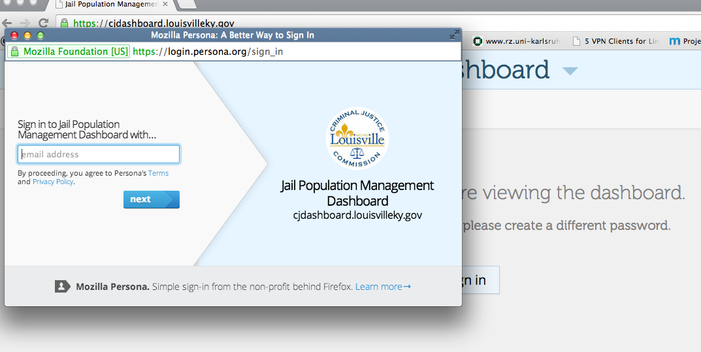

Mozilla BrowserID/Persona
=========================

Mozilla BrowserID, also called Persona, is an
[identity service for website login](https://login.persona.org/about):

> Persona replaces multiple passwords.
>
> Within Persona, your identity is your email address. You can use as many email addresses as you want, but you still only need one password.

_Identity_ means that Persona can tell you with confidence that a user with
a given email address is on your site. _Authorization_ is what you decide to
do with that knowledge: whether that user is allowed to see private data,
or change data. Team Louisville used Persona in 2013 to secure their app,
[read their extensive notes on our blog](http://www.codeforamerica.org/blog/2013/11/21/securing-the-louisville-app/).

Mozilla Persona is our first choice for login features in an app. Its use
is not mandated, but you should have a great reason not to.
Code for America projects currently using Persona include
[Engine Light](https://github.com/codeforamerica/engine-light) (Ruby),
[Oakland Answers](https://github.com/codeforamerica/oakland_answers) (Ruby),
[Louisville Jail Dashboard](https://github.com/codeforamerica/in-n-out) (PHP),
[Long Beach AddressIQ](https://github.com/codeforamerica/address-iq) (Python),
[Pittsburgh Template-Maker](https://github.com/codeforamerica/template-maker) (Python),
and [Oakland RecordTrac](https://github.com/codeforamerica/recordtrac) (Python).

Using Persona
-------------

Follow the [Quick Setup guide from Mozilla](https://developer.mozilla.org/en-US/Persona/Quick_Setup):

> Adding the Persona login system to your site takes just five steps:
> 
> 1. Include the Persona JavaScript library on your pages.
> 2. Add “login” and “logout” buttons.
> 3. Watch for login and logout actions.
> 4. Verify the user’s credentials.
> 5. Review best practices.

Steps 1-3 all take place client-side, and can be implemented in HTML and Javascript.
Persona [works in most browsers](https://developer.mozilla.org/en-US/Persona/Browser_compatibility):

> Internet Explorer: 8.0+, 9.0, 10.0+
>
> Firefox: Current Stable, Beta, Aurora, Nightly, and Extended Support Releases, Previous Stable Release.
>
> Chrome, Safari, Opera: Latest Stable Release.
>
> iOS Mobile Safari: iOS 5.x — 6.x+
>
> Android Default Browser: 2.2 — 4.x+

To work in IE8, your app [_must_ render pages in “standards mode”](https://blogs.msdn.com/b/askie/archive/2009/03/23/understanding-compatibility-modes-in-internet-explorer-8.aspx?Redirected=true).
See [this example change in Oakland RecordTrac from 2013](https://github.com/codeforamerica/recordtrac/pull/142) to trigger standards mode.

More example code from Code for America projects:

* Persona JavaScript library
  in [HTML](https://github.com/codeforamerica/address-iq/blob/0002ec3d6ee82e0e41f5da9c722dfedc86a52571/templates/layout.html#L12).
* “Login” and “logout” buttons
  in [Javascript](https://github.com/codeforamerica/address-iq/blob/0002ec3d6ee82e0e41f5da9c722dfedc86a52571/templates/layout.html#L48).
* Watching for login and logout actions
  in [Javascript](https://github.com/codeforamerica/engine-light/blob/d71dafa39555013385f6ed45d977269e1ebecd33/app/views/layouts/_navbar.html.erb#L20).
* Verifying the user’s credentials
  in [Python](https://github.com/codeforamerica/address-iq/blob/3a17c2334c2c7be5dc14e427f4d0908581cda7f0/app.py#L259),
  [PHP](https://github.com/codeforamerica/in-n-out/blob/1df95cb3e4f3f969af5a4fe4106b006355ba5f0e/public/api/v1/user.php#L69),
  and [Ruby](https://github.com/codeforamerica/engine-light/blob/d71dafa39555013385f6ed45d977269e1ebecd33/app/controllers/persona_controller.rb#L25).

You can customize the login popup with custom colors (`backgroundColor`),
your app name (`siteName`), and a logo (`siteLogo`), and other details by
passing options to `navigator.id.request()`.
[Read more in Mozilla’s `IdentityManager.request()` documentation](https://developer.mozilla.org/en-US/docs/Web/API/IdentityManager/request).
